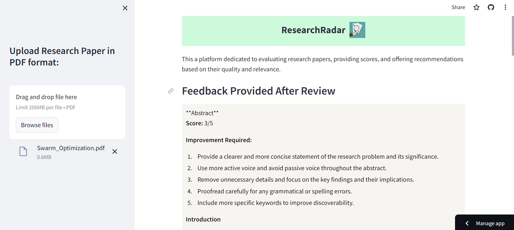

# ResearchRadar

ResearchRadar is a web platform designed for the evaluation of research papers, providing scores, and offering recommendations based on their quality and relevance.

Visit the live app: [ResearchRadar](https://researchradar-wkswakhfzyxjhrnsfu7gmw.streamlit.app/)

## Features:
- **Paper Evaluation:** ResearchRadar provides a comprehensive evaluation of research papers, considering various factors such as clarity, novelty, methodology, and significance.
- **Score Assignment:** Based on the evaluation criteria, ResearchRadar assigns scores to research papers, helping users gauge their quality at a glance.
- **Recommendations:** Leveraging advanced algorithms, ResearchRadar offers tailored recommendations for further reading, aiding researchers in discovering relevant literature.
- **User-Friendly Interface:** With a streamlined interface powered by Streamlit, ResearchRadar ensures ease of use and intuitive navigation for users.

## Technologies Used:
- LangChain
- Streamlit
- PyPDF2

## Installation:
1. Clone the repository: `git clone https://github.com/subhayudutta/ResearchRadar.git`
2. Navigate to the project directory: `cd ResearchRadar`
3. Install dependencies: `pip install -r requirements.txt`

## Usage:
1. Run the Streamlit app: `streamlit run app.py`
2. Access the app in your browser at `http://localhost:8501`

## Live App Usage

1. Visit the [ResearchRadar website](https://researchradar-wkswakhfzyxjhrnsfu7gmw.streamlit.app/).
2. Upload the pdf you want to chat with.
3. Enter your messages.
4. Chat with multiple PDFs using the power of generative AI.

## Contribution:
Contributions are welcome! Feel free to open an issue or submit a pull request.

## License:
This project is licensed under the [GPL-3.0 license](LICENSE).
Feel free to customize the README according to your project's specifics!

